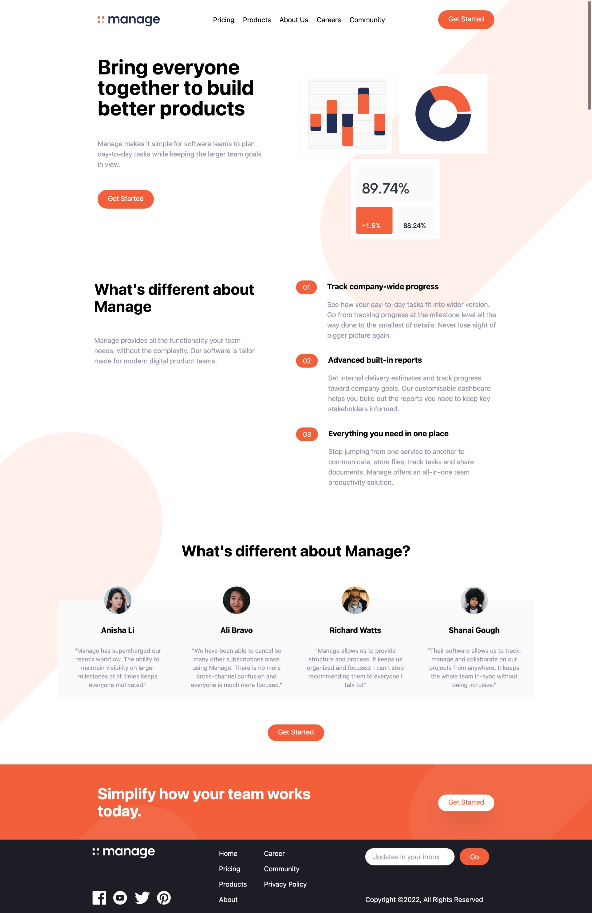
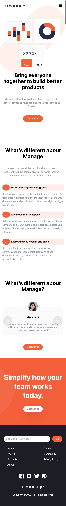

# Frontend Mentor - Manage landing page solution

This is a solution to the [Manage landing page challenge on Frontend Mentor](https://www.frontendmentor.io/challenges/manage-landing-page-SLXqC6P5). Frontend Mentor challenges help you improve your coding skills by building realistic projects.

## Table of contents

- [Overview](#overview)
  - [The challenge](#the-challenge)
  - [Screenshot](#screenshot)
  - [Links](#links)
- [My process](#my-process)
  - [Built with](#built-with)
  - [What I learned](#what-i-learned)
- [Author](#author)

**Note: Delete this note and update the table of contents based on what sections you keep.**

## Overview

### The challenge

Users should be able to:

- View the optimal layout for the site depending on their device's screen size
- See hover states for all interactive elements on the page
- See all testimonials in a horizontal slider
- Receive an error message when the newsletter sign up `form` is submitted if:
  - The `input` field is empty
  - The email address is not formatted correctly

### Screenshot



<!--  -->

### Links

- Solution URL: [Add solution URL here](https://github.com/mytaison/manage-landing-Page)
- Live Site URL: [Add live site URL here](https://manage-landing-page.mehedihasan.pro/)

## My process

### Built with

- Semantic HTML5 markup
- CSS custom properties
- Flexbox
- Tailwind CSS
- Javascript

### What I learned

It is my first project using Tailwind CSS. Only classbased CSS writing is completely new for me. I found it very interesting. I struggled here to set the background capsule shape object according to example desgin in both desktop and mobile mode.

To see how you can add code snippets, see below:

```html
<h1>Some HTML code I'm proud of</h1>
```

```css
.proud-of-this-css {
  color: papayawhip;
}
```

```js
const proudOfThisFunc = () => {
  console.log("🎉");
};
```

If you want more help with writing markdown, we'd recommend checking out [The Markdown Guide](https://www.markdownguide.org/) to learn more.

**Note: Delete this note and the content within this section and replace with your own learnings.**

## Author

- Website - [Mehedi Hasan](https://www.your-site.com)
- Frontend Mentor - [@mytaison](https://www.frontendmentor.io/profile/mytaison)
- Twitter - [@mytaison](https://www.twitter.com/mytaison)

**Note: Delete this note and add/remove/edit lines above based on what links you'd like to share.**
